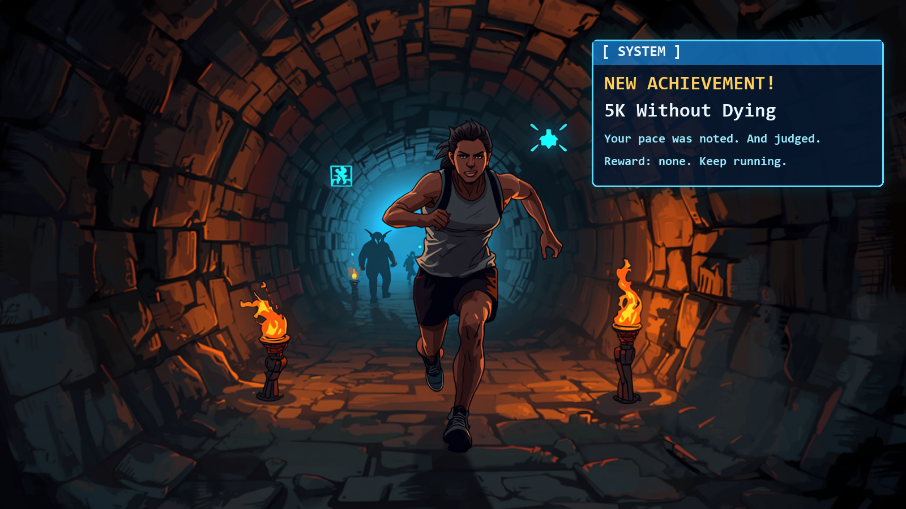

<p align="center">
  
</p>

<h1 align="center">WatchCrawler</h1>

<p align="center"><b>Your Garmin watch, narrated by a sarcastic dungeon "System".</b><br>
Finish a run, hit your step goal, or sit on the couch all day, and your watch pops up an RPG achievement about it.</p>

> **LEGENDARY ACHIEVEMENT — Outran Your Own Excuses**
> 10.2 km, 18% further than usual. The System is mildly impressed and deeply annoyed.
> *Reward: a slightly less judgmental stare.*

> **CURSED — Professional Furniture Tester**
> 412 steps today. The couch has filed a restraining order.
> *Reward: a participation trophy made of lint.*

---

## What you need

| | |
|---|---|
| ⌚ **A Garmin watch** | fenix 7 / 7 Pro / 8, epix Pro (see the [list](#supported-watches)) |
| 🔑 **An AI key** (yours, so you control the cost) | [Anthropic Claude](https://console.anthropic.com/settings/keys) (recommended) or [DeepSeek](https://platform.deepseek.com/api_keys) (cheapest) |
| ☁️ **A free Fly.io account** | runs your personal WatchCrawler server; setup creates it for you ([fly.io](https://fly.io)) |
| 🛠️ **Garmin's Connect IQ SDK** | one-time install, used to build the app for your watch ([download](https://developer.garmin.com/connect-iq/sdk/)) |

## How much will it cost?

You pay your AI provider directly. It's cheap:

| Notifications per day | Claude (Anthropic) | DeepSeek |
|---|---|---|
| 5 | ~$0.24 / month | ~$0.07 / month |
| **10** (typical) | **~$0.48 / month** | **~$0.14 / month** |
| 20 | ~$0.96 / month | ~$0.28 / month |

**$5 of credit (the minimum top-up) lasts about 10 months** with Claude at 10 notifications a day.
Setup shows the estimate for your own numbers. When your credit is running low, your watch shows a
**"Mana Reserves Low"** System message about two weeks ahead, and it still works after the credit
runs out (with built-in jokes) until you top up.

## Install in 3 steps

**1. Get an API key** from [Anthropic](https://console.anthropic.com/settings/keys) or [DeepSeek](https://platform.deepseek.com/api_keys), and add some credit ($5 is plenty).

**2. Run setup.** It asks a few questions, creates your server, and builds the watch app.

- **Mac / Linux:** paste this in a terminal:
  ```bash
  curl -fsSL https://raw.githubusercontent.com/yohananha/WatchCrawler/main/install.sh | bash
  ```
- **Windows:** install [Git for Windows](https://git-scm.com/download/win), [download this project](https://github.com/yohananha/WatchCrawler/archive/refs/heads/main.zip), unzip it, and double-click **`setup.cmd`**.

**3. Put it on your watch.** Plug the watch in with USB and copy **`WatchCrawler.prg`** (setup tells
you where it is) into the watch's **`GARMIN/Apps`** folder. Unplug it and open **WatchCrawler** once.
Done: achievements now pop up by themselves.

> 🍎 On a Mac, use [OpenMTP](https://openmtp.org) to see the watch's files.

## Everyday commands

| I want to… | Run |
|---|---|
| Update to the newest version | `git pull`, then `./setup.sh --build-only` and copy the new `.prg` |
| See what I've spent and what's left | `./setup.sh --usage` |
| Tell it I added credit | `./setup.sh --topup 10` (the dollars you added) |
| Switch AI provider or start over | `./setup.sh` |

(On Windows, run `setup.cmd` with the same options, e.g. `setup.cmd --usage`.)

## What triggers an achievement

Finishing any activity (judged against *your own* recent ones), reaching your step or floor goal,
an unusually good or bad resting heart rate, a low Body Battery, sitting too long, missing your
step goal, and the dreaded *"nothing achieved today"*. Quiet hours are 23:00–07:00, with at most
10 announcements a day. You can change these in `server/fly.toml` (the `DAY_*` values), then run
`fly deploy`.

## Privacy: what goes where

- **Your activity data** goes from the watch to **your own server**, then to **your chosen AI
  provider** to write the joke. It's never sent to the WatchCrawler developer.
- **Your API key** is stored only as an encrypted secret on your server, not on your computer
  and not in the watch app.
- **Error reports:** if something breaks, your server sends the developer a short report: what
  failed (for example "AI provider timed out" or a watch network error code), an anonymous install
  id, and the app version. **No keys, no activity or health data, no names.** Setup asks first. To
  turn it off later, set `REPORT_ERRORS=false` on your server (`fly secrets set REPORT_ERRORS=false`).

## Troubleshooting

| Problem | Fix |
|---|---|
| Nothing ever pops up | Open the app once after installing. Keep your phone nearby with Garmin Connect running, because the watch reaches the internet through it. Background checks run roughly every 5–30 minutes. |
| The watch says **"NOT SET UP: RUN SETUP"** | The app was built without a server address. Run `./setup.sh --build-only` and copy the new `.prg`. |
| Jokes feel generic or repeat | Your server can't reach the AI (bad key or no credit), so the watch uses built-in lines. Run `./setup.sh --usage`, and check `fly logs -a <your-app>`. |
| Setup says the Connect IQ SDK is missing | Install the [SDK Manager](https://developer.garmin.com/connect-iq/sdk/), download the SDK and your watch model inside it, then run `./setup.sh --build-only`. |
| Error **-1001** | The server address must start with `https://`. Fly.io handles this automatically. |

## Supported watches

`fenix847mm`, `fenix7`, `fenix7pro`, `fenix8solar47mm`, `fenix8pro47mm`, `epix2pro51mm`. Other
watches with Connect IQ 5.0+ will probably work: add your model's id to `watch/manifest.xml` and
download it in the SDK Manager. [Open an issue](https://github.com/yohananha/WatchCrawler/issues)
if it works (or doesn't).

---

<details>
<summary><b>For developers</b></summary>

| Folder | What |
|---|---|
| [`server/`](server/README.md) | ASP.NET Core (.NET 10) service: turns an event into achievement text through the LLM, tracks cost and credit, sends error reports |
| [`watch/`](watch/README.md) | Connect IQ (Monkey C) app: background event detection, notification, pixel-art animation |
| `setup.sh`, `setup.cmd`, `install.sh` | The user installer |
| `docker-compose.yml` | Run the server locally instead of on Fly.io |

**Developer builds** of the watch app keep the diagnostics screen (MENU), the fake-achievement
injector, remote test-trigger polling and the settings entries:
`watch/tools/build_personal.sh --dev <device>`. User builds (the default, and what setup makes)
leave all of these out. See [`watch/README.md`](watch/README.md).

The server image is built and published to `ghcr.io/yohananha/watchcrawler-server` by CI on every
push to `main`.
</details>
